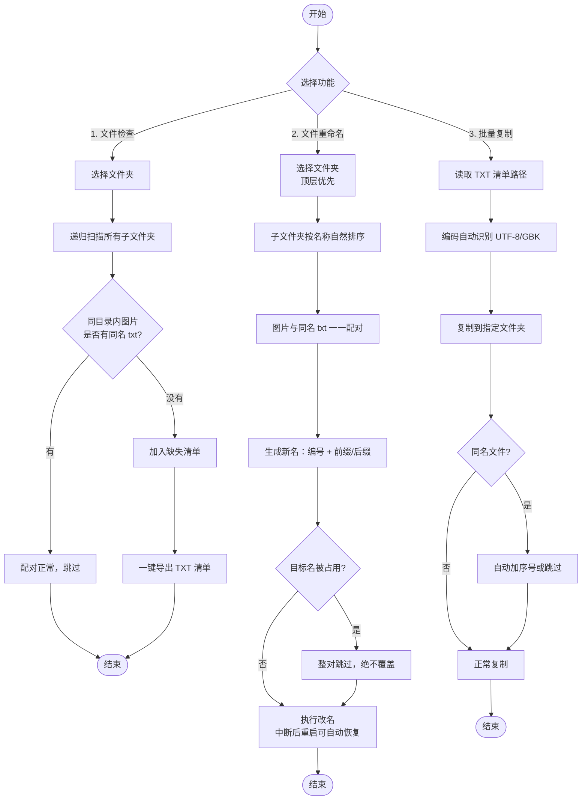

# 图片配对管理工具（IMAGE-TXT MANAGER）

<p align="center">


</p>

> AI 生图模型训练数据集管理工具 —— 管理图片与同名 txt 打标文件的配对关系，一键检查缺失、批量重命名、批量复制。

An AI-generated-image training dataset manager: check, rename and copy image files with their paired .txt caption files, all in one tool. Pure Python stdlib, zero dependencies.

## 使用场景

训练 AI 生图模型（如 LoRA、Stable Diffusion 微调）时，每张训练图通常对应一个同名 `.txt` 打标文件。数据集数量动辄上万，人工管理文件名非常痛苦。本工具解决三个痛点：

- **缺标检查**：递归扫描整个数据集文件夹，找出"有图片但没有同名 txt"的图片，一键导出清单
- **批量重命名**：图片与同名 txt 一一对应改名（编号 / 前缀 / 后缀），改名后配对关系不破坏
- **批量复制**：读取导出的清单路径，把文件批量复制到指定文件夹

## 功能

### 1. 文件检查

.png)

- 递归扫描所选文件夹及其全部子文件夹
- 列出所有「有图片但同目录内无同名 txt」的图片（跨文件夹同名图片各自配对，互不干扰）
- 一键导出缺失清单 TXT，每行一个完整路径，保存位置可自选

### 2. 文件重命名

.png)

- 顶层文件夹优先处理，再递归子文件夹（按名称自然排序，`2` 排在 `10` 前面）
- 图片与同名 txt **同进同退**：改同一个新名、扩展名不变，配对关系绝不破坏
- 编号默认从 `000001` 开始，可自定义起始编号、位数、前缀、后缀
  - 前缀 `写真集` → `写真集000001.jpg`
  - 后缀 `写真集` → `000001写真集.jpg`
- 编号全局连续，跨文件夹不重置
- 冲突安全：目标名被占用时整对跳过、绝不覆盖；执行中断后重启可自动恢复

### 3. 批量复制

.png)

- 读取一个或多个 TXT 清单中的文件路径，复制到指定文件夹
- 兼容带引号、含制表符、注释行等多种导出格式；UTF-8 / GBK 编码自动识别
- 同名文件可自动加序号或跳过（绝不覆盖）

## 核心流程



> 完整功能流程图（HTML 静态版）：[功能流程图.html](图片配对管理工具/功能流程图.html)

## 使用方法

**方式一：直接使用（推荐）**

> 系统要求：Windows 10 / 11（64 位），exe 免安装，下载后直接双击运行。

下载 Releases 中的 `图片配对管理工具.exe`，双击运行（Windows）。

**方式二：源码运行**

```bash
python 图片配对管理工具.py
```

环境要求：Python 3.8+，仅使用 tkinter 标准库，**零第三方依赖**。

## 界面

深色复古风格 UI ，支持高 DPI 缩放，全中文界面。上方三个功能截图即为实际运行效果。

## 项目结构

```
image-txt-manager/
├── 图片配对管理工具/        # 主程序文件夹
│   ├── 图片配对管理工具.py   # 主程序（单文件，可打包为 exe）
│   ├── 图片配对管理工具.exe  # 打包好的可执行文件
│   ├── 使用说明.md           # 详细使用说明
│   ├── 功能流程图.html       # 功能流程（HTML 静态版）
│   ├── icon.ico / icon_win_*.png  # 程序图标
│   ├── test_logic.py         # 核心逻辑回归测试
│   ├── test_gui_smoke.py     # GUI 冒烟测试
│   └── 示例数据/             # 示例文件夹（演示配对/缺失场景）
├── 界面截图/                 # README 展示用界面截图
├── LICENSE                   # MIT 协议
└── README.md
```

## 测试

```bash
python test_logic.py        # 核心逻辑回归测试（32 项断言）
python 图片配对管理工具.py --selftest   # 内置自检
```

---

如果这个工具帮到了你，欢迎点个 ⭐ **Star** 支持一下，让更多人看到它。

## 协议

MIT License
